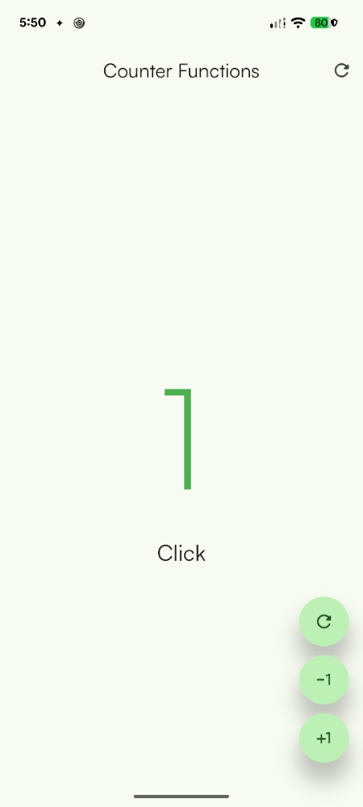
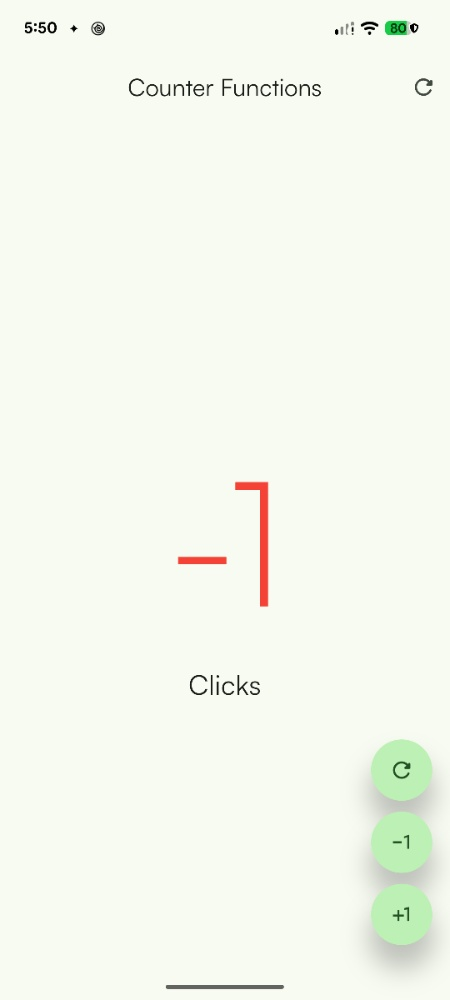
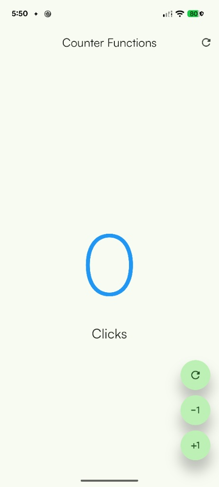

# Práctica 2: Mi Primera Aplicación Móvil con Flutter

## Descripción
Proyecto introductorio al desarrollo móvil multiplataforma utilizando el framework **Flutter** y la sintaxis de **Dart**. En esta aplicación se construyó un contador interactivo estructurado mediante múltiples pantallas, enfocándose en la modularización del código, el manejo básico del estado de la interfaz de usuario, la reutilización de componentes visuales (widgets) y la personalización estética de la aplicación.

## Objetivo
Desarrollar una aplicación móvil funcional en Flutter que permita comprender el ciclo de vida de la interfaz de usuario, aplicar principios de reutilización de componentes mediante *Custom Widgets*, y personalizar temas visuales y fuentes tipográficas globales en la app.

## Actividades
* **Estructuración y Navegación:** Creación del proyecto base en Flutter y configuración de la estructura de carpetas para gestionar pantallas (*screens*) e interfaces principales.
* **Lógica del Contador:** Implementación de funciones para gestionar la actualización del estado al interactuar con el usuario:
  * **Incrementar:** Aumenta el valor del contador.
  * **Decrementar:** Reduce el valor del contador.
  * **Resetear:** Restablece la cuenta a cero.
* **Reutilización de Widgets:** Abstracción y codificación de un widget personalizado para los botones de acción, permitiendo instanciar componentes modulares con propiedades configurables (icono, acción al presionar, estilo) sin duplicar código.
* **Personalización del Tema:** Configuración global de la paleta de colores del `ThemeData`, seleccionando una identidad visual basada en tonos **verde**.
* **Gestión de Tipografía Personalizada:** Integración y configuración de la fuente **Satoshi** en el archivo `pubspec.yaml` y su aplicación en los estilos de texto globales.

---

## Resultados

A continuación se presentan las capturas de pantalla de la aplicación en ejecución, mostrando la interfaz terminada, los botones personalizados, el tema verde aplicado y la tipografía Satoshi:

| Numero positivo en verde | Numero negativo rojo | Numer neutro azul |
| :---: | :---: | :---: |
|  |  |  |

## Diagrama y Estructura del Proyecto
[Ver Arquitectura](https://heidrihen52.github.io/Practicas_DMI_230052/Practica02/)