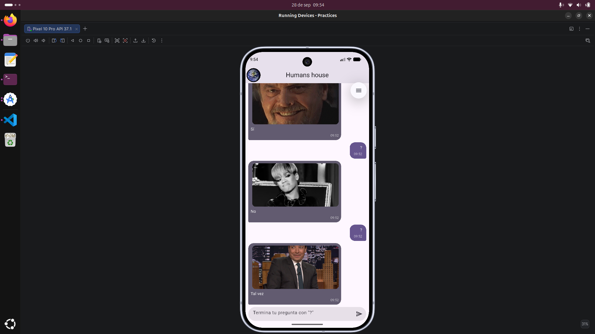
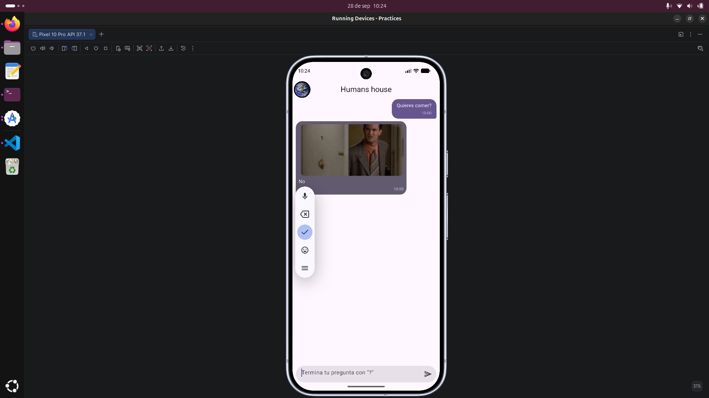
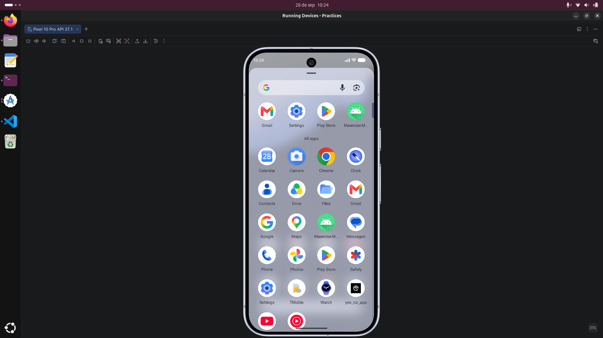

# Práctica 3: Yes, No, Maybe — Chat con API de Respuestas Automáticas

## Descripción
Desarrollo de una aplicación móvil en **Flutter** con una interfaz de chat inspirada en aplicaciones de mensajería como **WhatsApp**. La aplicación permite al usuario escribir preguntas que terminen con el signo de interrogación (`?`) y recibir respuestas automáticas utilizando la API de **yesno.wtf**.

La lógica de respuestas se implementó con una distribución aproximada de **40% Sí**, **40% No** y **20% Tal Vez**, mostrando además el **GIF correspondiente** a la respuesta obtenida. La aplicación también incorpora mensajes en forma de burbujas, hora de envío y elementos visuales personalizados.

## Objetivo
Desarrollar una aplicación móvil de chat en Flutter que permita enviar preguntas y obtener respuestas automáticas mediante el consumo de una API externa, implementando lógica de selección de respuestas, manejo de mensajes, visualización de imágenes animadas y personalización de la interfaz.

## Actividades
* **Creación del Proyecto:** Configuración inicial de la aplicación utilizando **Flutter** y **Dart**, organizando el código mediante pantallas, modelos y widgets personalizados.

* **Diseño de la Interfaz de Chat:** Desarrollo de una interfaz de conversación inspirada en aplicaciones como **WhatsApp**, utilizando burbujas de mensajes diferenciadas para el usuario y las respuestas automáticas.

* **Captura de Mensajes:** Implementación de un campo de texto que permite al usuario escribir y enviar preguntas dentro de la aplicación.

* **Validación de Preguntas:** Configuración de la lógica para procesar principalmente mensajes que finalicen con el signo de interrogación (`?`).

* **Consumo de API:** Integración de la API de **yesno.wtf** para obtener respuestas automáticas y mostrar los GIF asociados a cada respuesta.

* **Distribución de Respuestas:** Implementación de una lógica de selección con la siguiente distribución:
  * **40% Sí**
  * **40% No**
  * **20% Tal Vez**

* **Visualización de GIFs:** Presentación de la imagen animada proporcionada por la API junto con la respuesta automática generada.

* **Hora de los Mensajes:** Incorporación de la hora de envío en cada mensaje, manteniendo un estilo similar al utilizado en aplicaciones de mensajería instantánea.

* **Creación de Ícono Personalizado:** Diseño y configuración de un ícono personalizado para identificar la aplicación en el dispositivo móvil.

* **Reutilización de Widgets:** Creación de componentes reutilizables para representar mensajes enviados y recibidos, facilitando la organización y mantenimiento del código.

---

## Resultados

A continuación se presentan las capturas de pantalla de la aplicación en ejecución, mostrando la interfaz de chat, el envío de preguntas, las respuestas automáticas y los GIF obtenidos mediante la API:

| Vista principal del chat | Pregunta y respuesta | Icono Personalizado|
| :---: | :---: | :---: |
|  |  |  |

## Diagrama y Estructura del Proyecto

[Ver Arquitectura](https://heidrihen52.github.io/Practicas_DMI_230052/Practica03/architecture/)